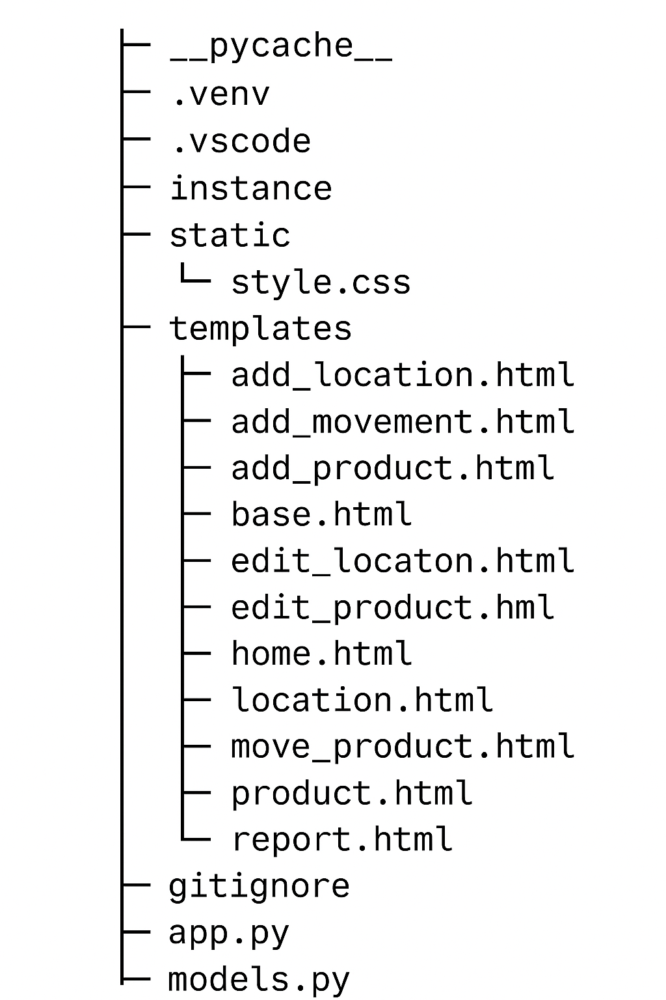

 Inventory Management System

This project is a simple Flask-based web application for managing products, locations, and product movements between locations. It helps in tracking stock quantities and storage details in an organized way.

 Project Overview

The Inventory Management System allows users to:

- Add, edit, and delete products
- Add and manage storage locations
- Record product movements between locations
- Generate a basic inventory report showing quantities and transfers

The system uses Flask for the backend, SQLite as the database, and Jinja2 templates for rendering HTML pages.

 Logic Explanation

The main logic of this project is based on three database models:

1. Product– Stores each product name, quantity, and location.  
2. Location – Represents storage areas where products are kept.  
3. Movement – Tracks transfers of products between locations.

 Movement Logic
- If only the To location is filled, it means new stock is added (incoming).
- If only the From location is filled, it means stock is removed (outgoing).
- If both are filled, the product is moved from one location to another.

Each time a movement is recorded, product quantities are automatically updated in the database.

Tech Stack

| Component       | Technology |
| Framework       | Flask      |
| Database        | SQLite     |
| Frontend        | HTML, CSS  |
| Template Engine | Jinja2     |
| Language        | Python 3   |

 Folder Structure
 
 

 

 Demo
 
Watch the project demonstration here: https://drive.google.com/file/d/1II-TTmcML4TQ-kAqQeqoCmjaEFmNuoFh/view?usp=sharing

Access the hosted application here: https://inventory-4o4u.onrender.com
